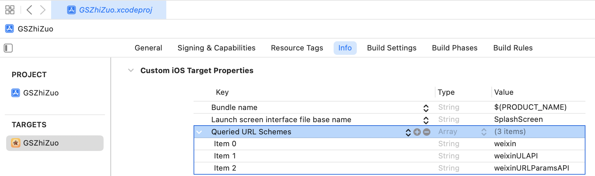

# expo-react-native-wechat-v2

[](https://www.npmjs.com/package/expo-react-native-wechat-v2)
[](https://github.com/zeeklog/expo-react-native-wechat-v2/blob/main/LICENSE)
[](https://reactnative.dev/)
[](https://expo.dev/)

> 专为 Expo React Native 项目设计的微信 SDK 封装库，提供完整的微信功能集成

本库为 expo react native 项目提供 Wechat SDK 支持, 集成了微信SDK:
- **Android SDK**: 6.8.23 +
- **iOS SDK**: 2.0.2 +

## 📋 目录

- [✨ 特性](#-特性)
- [📦 安装](#-安装)
- [🚀 快速开始](#-快速开始)
- [⚙️ 配置指南](#️-配置指南)
- [📚 API 文档](#-api-文档)
- [🔄 事件处理](#-事件处理)
- [🛠️ 错误处理](#️-错误处理)
- [📱 使用示例](#-使用示例)
- [📋 注意事项](#-注意事项)
- [🤝 贡献](#-贡献)
- [📄 许可证](#-许可证)

## ✨ 特性

| 功能 | 描述 | 支持平台 |
|------|------|----------|
| 🔐 **微信登录授权** | 支持 OAuth2 授权登录 | iOS / Android |
| 📤 **内容分享** | 支持文本、图片、音乐、视频、网页、小程序分享 | iOS / Android |
| 💰 **微信支付** | 完整的支付流程集成 | iOS / Android |
| 🚀 **小程序跳转** | 支持跳转到微信小程序 | iOS / Android |
| 📝 **TypeScript** | 完整的类型定义支持 | 全平台 |
| 🎯 **Expo 友好** | 专为 Expo 项目优化 | Expo |
| 🔄 **Promise API** | 现代化的异步处理方式 | 全平台 |
| 📱 **跨平台支持** | 同时支持 iOS 和 Android | iOS / Android |

## 📦 安装

### 使用 Expo CLI（推荐）
```bash
npx expo install expo-react-native-wechat-v2
```

### 使用 yarn
```bash
yarn add expo-react-native-wechat-v2
```

### 使用 npm
```bash
npm install expo-react-native-wechat-v2 --save
```

## 🚀 快速开始

### 1. 基础配置

#### Expo 项目配置

在项目根目录的 `app.json` 中添加配置：

```json
{
  "expo": {
    "ios": {
      "infoPlist": {
        "LSApplicationQueriesSchemes": ["weixin", "weixinULAPI", "weixinURLParamsAPI"],
        "CFBundleURLTypes": [
          {
            "CFBundleTypeRole": "Editor",
            "CFBundleURLName": "weixin",
            "CFBundleURLSchemes": ["wx5555555555555555"]
          }
        ]
      }
    }
  }
}
```

#### 执行预构建
- 生成`./ios` 和 `./android` 项目文件夹
```bash
npx expo prebuild
```

### 2. 基础使用

```javascript
import * as WeChat from 'expo-react-native-wechat-v2';

// 注册微信应用
// 项目中只需要全局注册一次， 多次注册可能会导致意想不到的问题发生；
await WeChat.registerApp('wx5555555555555555', 'https://your-domain.com/');

// 检查微信是否安装
const isInstalled = await WeChat.isWXAppInstalled();

// 分享文本
await WeChat.shareText({
  text: 'Hello from React Native!',
  scene: 0, // 0: 会话, 1: 朋友圈, 2: 收藏
});
```

## ⚙️ 配置指南

### iOS Universal Links 配置

#### 1. 苹果开发者后台配置

1. 登录 [Apple Developer](https://developer.apple.com/account/resources/identifiers/list)
2. 开启 Associated Domains 功能
3. 记录项目的 Team ID

#### 2. 创建 apple-app-site-association 文件

```json
{
   "applinks": {
       "apps": [],
       "details": [
           {
               "appID": "com.douyin.sample",
               "paths": [ "*" ]
           }
       ]
   }
}
```

**重要注意事项：**

| 项目 | 说明 |
|------|------|
| **文件命名** | apple-app-site-association（无后缀名） |
| **appID 格式** | TeamID.BundleID |
| **文件位置** | 网站根目录或 `.well-known` 目录 |
| **域名要求** | 必须支持 HTTPS |
| **验证地址** | `https://app-site-association.cdn-apple.com/a/v1/your-domain.com` |
| **生效时间** | 因苹果更新机制，可能需要 1-2 天生效 |

#### 3. Xcode 配置

在 Xcode 中设置 Associated Domains：
- `Targets` → `Signing & Capabilities` → `Associated Domains`
- 添加：`applinks:your-domain.com`


### Expo 一键配置

1. 在项目根目录的 `app.json` 中添加配置：

```json
{
    "expo": {
        "ios": {
          "infoPlist": {
            "LSApplicationQueriesSchemes": ["weixin", "weixinULAPI", "weixinURLParamsAPI"],
            "CFBundleURLTypes": [
              {
                "CFBundleTypeRole": "Editor",
                "CFBundleURLName": "wexin",
                "CFBundleURLSchemes": ["wx5555555555555555"]
              }
            ]
          }
        }
    }
}
```

2. 执行命令：
```bash
npx expo prebuild
```

### React Native 手动配置

#### iOS 配置

1. **URL Schemes 配置**
   - Xcode → `Targets` → `Info` → `URL Types`
   - 添加微信 AppID：`wx5555555555555555`


或者在 `Info.plist` 文件中添加：
```xml
<key>CFBundleURLTypes</key>
<array>
    <dict>
        <key>CFBundleTypeRole</key>
        <string>Editor</string>
        <key>CFBundleURLName</key>
        <string>wexin</string>
        <key>CFBundleURLSchemes</key>
        <array>
            <string>wx5555555555555555</string>
        </array>
    </dict>
</array>
```

2. **Queried URL Schemes 配置**
   - 添加：`weixin`、`weixinULAPI`、`weixinURLParamsAPI`



或者在 `Info.plist` 文件中添加：
```xml
<key>LSApplicationQueriesSchemes</key>
<array>
    <string>weixin</string>
    <string>weixinULAPI</string>
    <string>weixinURLParamsAPI</string>
</array>
```

#### Android 配置

Android 无需额外配置，库会自动处理。

## 📚 API 文档

本库支持 `TypeScript`，使用 `Promise` 或 `async/await` 来接收返回。

接口名称和参数尽量跟腾讯官网保持一致性，除了嵌套对象变成扁平对象，你可以直接查看腾讯文档来获得更多帮助。

### 基础功能

#### `registerApp(appId, universalLink?)` - 注册应用

| 参数 | 类型 | 必填 | 说明 |
|------|------|------|------|
| `appId` | String | ✅ | 微信开放平台获取的 AppID |
| `universalLink` | String | ❌ | iOS Universal Link |

**返回值：** `Promise<Boolean>`

```javascript
import * as WeChat from 'expo-react-native-wechat-v2';

// 注册微信应用（全局调用一次）
await WeChat.registerApp('wx5555555555555555', 'https://your-domain.com/');
```

#### `isWXAppInstalled()` - 检查微信安装状态

**返回值：** `Promise<Boolean>`

```javascript
const isInstalled = await WeChat.isWXAppInstalled();
console.log('微信是否已安装:', isInstalled);
```

#### `isWXAppSupportApi()` - 检查 API 支持

**返回值：** `Promise<Boolean>`

```javascript
const isSupported = await WeChat.isWXAppSupportApi();
console.log('微信 API 是否支持:', isSupported);
```

#### `getApiVersion()` - 获取 SDK 版本

**返回值：** `Promise<String>`

```javascript
const version = await WeChat.getApiVersion();
console.log('微信 SDK 版本:', version);
```

#### `openWXApp()` - 打开微信应用

**返回值：** `Promise<Boolean>`

```javascript
await WeChat.openWXApp();
```

### 授权登录

#### `sendAuthRequest(scope?, state?)` - 微信授权登录

| 参数 | 类型 | 必填 | 说明 |
|------|------|------|------|
| `scope` | Array/String | ❌ | 授权范围 |
| `state` | String | ❌ | OAuth2 状态参数 |

**返回值：** `Promise<AuthResponse>`

| 字段 | 类型 | 说明 |
|------|------|------|
| `errCode` | Number | 错误代码 |
| `errStr` | String | 错误信息 |
| `openId` | String | 用户唯一标识 |
| `code` | String | 授权码 |
| `url` | String | URL 字符串 |
| `lang` | String | 用户语言 |
| `country` | String | 用户国家 |

```javascript
const authResult = await WeChat.sendAuthRequest(['snsapi_userinfo'], 'state123');
console.log('授权结果:', authResult);
```

### 分享功能

#### `shareText(data)` - 分享文本

| 参数 | 类型 | 必填 | 说明 |
|------|------|------|------|
| `text` | String | ✅ | 分享文本内容 |
| `scene` | Number | ❌ | 分享场景（0: 会话, 1: 朋友圈, 2: 收藏） |

```javascript
await WeChat.shareText({
  text: '分享的文本内容',
  scene: 0,
});
```

#### `shareImage(data)` - 分享网络图片

| 参数 | 类型 | 必填 | 说明 |
|------|------|------|------|
| `imageUrl` | String | ✅ | 图片网络地址 |
| `scene` | Number | ❌ | 分享场景 |

```javascript
await WeChat.shareImage({
  imageUrl: 'https://example.com/image.jpg',
  scene: 0,
});
```

#### `shareLocalImage(data)` - 分享本地图片

| 参数 | 类型 | 必填 | 说明 |
|------|------|------|------|
| `imageUrl` | String | ✅ | 本地图片路径 |
| `scene` | Number | ❌ | 分享场景 |

```javascript
await WeChat.shareLocalImage({
  imageUrl: 'file:///path/to/local/image.jpg',
  scene: 0,
});
```

#### `shareMusic(data)` - 分享音乐

| 参数 | 类型 | 必填 | 说明 |
|------|------|------|------|
| `title` | String | ❌ | 音乐标题 |
| `description` | String | ❌ | 音乐描述 |
| `thumbImageUrl` | String | ❌ | 缩略图（自动压缩到32KB） |
| `musicUrl` | String | ✅ | 音乐网页URL |
| `musicLowBandUrl` | String | ❌ | 低带宽音乐URL |
| `musicDataUrl` | String | ❌ | 音乐数据URL |
| `musicLowBandDataUrl` | String | ❌ | 低带宽音乐数据URL |
| `scene` | Number | ❌ | 分享场景 |

```javascript
await WeChat.shareMusic({
  title: '音乐标题',
  description: '音乐描述',
  musicUrl: 'https://example.com/music.mp3',
  thumbImageUrl: 'https://example.com/thumb.jpg',
  scene: 0,
});
```

#### `shareVideo(data)` - 分享视频

| 参数 | 类型 | 必填 | 说明 |
|------|------|------|------|
| `title` | String | ❌ | 视频标题 |
| `description` | String | ❌ | 视频描述 |
| `thumbImageUrl` | String | ❌ | 缩略图（自动压缩到32KB） |
| `videoUrl` | String | ✅ | 视频链接 |
| `videoLowBandUrl` | String | ❌ | 低带宽视频链接 |
| `scene` | Number | ❌ | 分享场景 |

```javascript
await WeChat.shareVideo({
  title: '视频标题',
  description: '视频描述',
  videoUrl: 'https://example.com/video.mp4',
  thumbImageUrl: 'https://example.com/thumb.jpg',
  scene: 0,
});
```

#### `shareWebpage(data)` - 分享网页

| 参数 | 类型 | 必填 | 说明 |
|------|------|------|------|
| `title` | String | ❌ | 网页标题 |
| `description` | String | ❌ | 网页描述 |
| `thumbImageUrl` | String | ❌ | 缩略图（自动压缩到32KB） |
| `webpageUrl` | String | ✅ | 网页链接 |
| `scene` | Number | ❌ | 分享场景 |

```javascript
await WeChat.shareWebpage({
  title: '网页标题',
  description: '网页描述',
  webpageUrl: 'https://example.com',
  thumbImageUrl: 'https://example.com/thumb.jpg',
  scene: 0,
});
```

#### `shareMiniProgram(data)` - 分享小程序

| 参数 | 类型 | 必填 | 说明 |
|------|------|------|------|
| `title` | String | ❌ | 小程序标题 |
| `description` | String | ❌ | 小程序描述 |
| `thumbImageUrl` | String | ❌ | 缩略图（自动压缩到32KB） |
| `userName` | String | ✅ | 小程序原始ID |
| `path` | String | ❌ | 小程序页面路径 |
| `hdImageUrl` | String | ❌ | 高清预览图（6.5.9+支持） |
| `withShareTicket` | String | ❌ | 是否使用带shareTicket的分享 |
| `miniProgramType` | Number | ❌ | 小程序类型（0:正式版, 1:开发版, 2:体验版） |
| `webpageUrl` | String | ❌ | 兼容低版本的网页链接 |
| `scene` | Number | ❌ | 分享场景 |

```javascript
await WeChat.shareMiniProgram({
  title: '小程序标题',
  description: '小程序描述',
  userName: 'gh_d39d10000000',
  path: 'pages/index/index',
  webpageUrl: 'https://example.com/fallback.html',
  thumbImageUrl: 'https://example.com/thumb.jpg',
  scene: 0,
});
```

#### `shareFile(data)` - 分享文件

| 参数 | 类型 | 必填 | 说明 |
|------|------|------|------|
| `url` | String | ✅ | 文件地址 |
| `title` | String | ❌ | 文件标题 |
| `ext` | String | ❌ | 文件扩展名 |
| `scene` | Number | ❌ | 分享场景（仅支持会话） |

```javascript
await WeChat.shareFile({
  url: 'file:///path/to/file.pdf',
  title: '文件标题',
  ext: 'pdf',
  scene: 0,
});
```

### 小程序功能

#### `launchMiniProgram(data)` - 跳转到小程序

| 参数 | 类型 | 必填 | 说明 |
|------|------|------|------|
| `userName` | String | ✅ | 小程序原始ID |
| `miniProgramType` | Number | ❌ | 小程序类型（0:正式版, 1:开发版, 2:体验版） |
| `path` | String | ❌ | 小程序页面路径 |

```javascript
await WeChat.launchMiniProgram({
  userName: 'gh_d39d10000000',
  miniProgramType: 0,
  path: 'pages/index/index?id=123',
});
```

#### `subscribeMessage(data)` - 订阅消息

| 参数 | 类型 | 必填 | 说明 |
|------|------|------|------|
| `scene` | Number | ❌ | 订阅场景（0-10000） |
| `templateId` | String | ✅ | 订阅消息模板ID |
| `reserved` | String | ❌ | 保留参数（防CSRF攻击） |

```javascript
await WeChat.subscribeMessage({
  scene: 0,
  templateId: 'template_id_here',
  reserved: 'reserved_data',
});
```

### 支付功能

#### `pay(data)` - 微信支付

| 参数 | 类型 | 必填 | 说明 |
|------|------|------|------|
| `partnerId` | String | ✅ | 商家ID |
| `prepayId` | String | ✅ | 预支付订单ID |
| `nonceStr` | String | ✅ | 随机字符串 |
| `timeStamp` | String | ✅ | 时间戳 |
| `package` | String | ✅ | 包名（固定为"Sign=WXPay"） |
| `sign` | String | ✅ | 签名 |

```javascript
await WeChat.pay({
  partnerId: 'partner_id',
  prepayId: 'prepay_id',
  nonceStr: 'nonce_str',
  timeStamp: 'timestamp',
  package: 'Sign=WXPay',
  sign: 'signature',
});
```

### 发票功能

#### `chooseInvoice(data)` - 选择发票

| 参数 | 类型 | 必填 | 说明 |
|------|------|------|------|
| `cardSign` | String | ❌ | 签名 |
| `signType` | String | ❌ | 签名类型 |
| `timeStamp` | Number | ❌ | 当前时间戳 |
| `nonceStr` | String | ❌ | 随机字符串 |

**返回值：** `Promise<{errCode, errStr, cards: Invoice[]}>`

| 字段 | 类型 | 说明 |
|------|------|------|
| `errCode` | Number | 错误代码 |
| `errStr` | String | 错误信息 |
| `cards` | Invoice[] | 发票数据数组 |

```javascript
const result = await WeChat.chooseInvoice({
  cardSign: 'card_sign',
  signType: 'SHA256',
  timeStamp: Date.now(),
  nonceStr: `${Date.now()}`,
});

console.log('发票数据:', result.cards);
```

## 🔄 事件处理

### 设置事件监听器

从小程序回到 APP，或者支付成功回到 APP 都会触发回调事件来返回相应信息，请在触发相应方法前提前添加事件队列。

```javascript
import { DeviceEventEmitter } from 'react-native';

// 监听微信请求事件
DeviceEventEmitter.addListener('WeChat_Req', (req) => {
  console.log('微信请求事件:', req);
  if (req.type === 'LaunchFromWX.Req') {
    // 从小程序回到APP
    handleMiniProgramCallback(req.extMsg);
  }
});

// 监听微信响应事件
DeviceEventEmitter.addListener('WeChat_Resp', (resp) => {
  console.log('微信响应事件:', resp);
  if (resp.type === 'WXLaunchMiniProgramReq.Resp') {
    // 小程序跳转回调
    handleMiniProgramCallback(resp.extMsg);
  } else if (resp.type === 'SendMessageToWX.Resp') {
    // 分享消息回调
    handleShareCallback(resp);
  } else if (resp.type === 'PayReq.Resp') {
    // 支付回调
    handlePayCallback(resp);
  }
});
```

### 使用事件发射器

```javascript
import * as WeChat from 'expo-react-native-wechat-v2';

// 添加事件监听器
WeChat.addListener('SendMessageToWX.Resp', (resp) => {
  console.log('分享结果:', resp);
});

// 一次性监听器
WeChat.once('PayReq.Resp', (resp) => {
  console.log('支付结果:', resp);
});

// 移除所有监听器
WeChat.removeAllListeners('SendMessageToWX.Resp');
```

## 🛠️ 错误处理

### WechatError 类

所有 API 调用失败时会抛出 `WechatError` 异常：

```javascript
import * as WeChat from 'expo-react-native-wechat-v2';

try {
  await WeChat.shareText({ text: 'Hello' });
} catch (error) {
  if (error instanceof WeChat.WechatError) {
    console.log('错误代码:', error.code);
    console.log('错误信息:', error.message);
  }
}
```

### 常见错误代码

| 错误代码 | 说明 | 处理建议 |
|---------|------|----------|
| -1 | 通用错误 | 检查参数和网络连接 |
| -2 | 用户取消 | 用户主动取消操作 |
| -3 | 发送失败 | 检查微信是否安装 |
| -4 | 授权失败 | 检查AppID配置 |
| -5 | 微信不支持 | 检查微信版本 |

## 📱 使用示例

### 基础调用示例

```javascript
import { StatusBar } from 'expo-status-bar';
import React from 'react';
import { StyleSheet, Text, View } from 'react-native';
import * as WeChat from 'expo-react-native-wechat-v2';

export default function App() {
    return (
        <View style={styles.container}>
            <Text onPress={()=>{
                WeChat.registerApp('wx5555555555555555', 'https://www.baidu.com/').then((a)=>{
                    console.log("==registerApp==>",a);
                });
            }}>registerApp</Text>
            <Text onPress={()=>{
                WeChat.isWXAppInstalled().then((a)=>{
                    console.log("==isWXAppInstalled==>",a);
                });
            }}>isWXAppInstalled</Text>
            <Text onPress={()=>{
                WeChat.getApiVersion().then((a)=>{
                    console.log("==getApiVersion==>",a);
                });
            }}>getApiVersion</Text>
            <Text onPress={()=>{
                WeChat.openWXApp().then((a)=>{
                    console.log("==openWXApp==>",a);
                });
            }}>openWXApp</Text>
            <Text onPress={()=>{
                WeChat.shareText({
                    text: 'Text content.',
                    scene: 0,
                }).then((a)=>{
                    console.log("==shareText==>",a);
                });
            }}>shareText</Text>
            <StatusBar style="auto" />
        </View>
    );
}

const styles = StyleSheet.create({
    container: {
        flex: 1,
        backgroundColor: '#fff',
        alignItems: 'center',
        justifyContent: 'center',
    },
});
```

### 现代化应用示例

```javascript
import React from 'react';
import { View, Text, TouchableOpacity, StyleSheet } from 'react-native';
import * as WeChat from 'expo-react-native-wechat-v2';

export default function App() {
  const [isRegistered, setIsRegistered] = React.useState(false);

  React.useEffect(() => {
    // 注册微信应用
    WeChat.registerApp('wx5555555555555555', 'https://your-domain.com/')
      .then(() => setIsRegistered(true))
      .catch(console.error);
  }, []);

  const handleShareText = async () => {
    try {
      await WeChat.shareText({
        text: 'Hello from React Native!',
        scene: 0,
      });
      console.log('分享成功');
    } catch (error) {
      console.error('分享失败:', error);
    }
  };

  const handleWeChatLogin = async () => {
    try {
      const result = await WeChat.sendAuthRequest(['snsapi_userinfo']);
      console.log('登录成功:', result);
    } catch (error) {
      console.error('登录失败:', error);
    }
  };

  return (
    <View style={styles.container}>
      <Text style={styles.title}>微信 SDK 示例</Text>
      
      <TouchableOpacity style={styles.button} onPress={handleShareText}>
        <Text style={styles.buttonText}>分享文本</Text>
      </TouchableOpacity>
      
      <TouchableOpacity style={styles.button} onPress={handleWeChatLogin}>
        <Text style={styles.buttonText}>微信登录</Text>
      </TouchableOpacity>
    </View>
  );
}

const styles = StyleSheet.create({
  container: {
    flex: 1,
    justifyContent: 'center',
    alignItems: 'center',
    padding: 20,
  },
  title: {
    fontSize: 24,
    fontWeight: 'bold',
    marginBottom: 30,
  },
  button: {
    backgroundColor: '#07C160',
    padding: 15,
    borderRadius: 8,
    marginVertical: 10,
    width: 200,
    alignItems: 'center',
  },
  buttonText: {
    color: 'white',
    fontSize: 16,
    fontWeight: 'bold',
  },
});
```

## 📋 注意事项

| 项目 | 说明 |
|------|------|
| **AppID 配置** | 确保使用正确的微信 AppID |
| **Universal Links** | iOS 需要正确配置 Universal Links |
| **图片大小** | 缩略图会自动压缩到 32KB 以内 |
| **权限检查** | 使用前检查微信是否安装 |
| **错误处理** | 始终处理可能的异常情况 |
| **回调处理** | 正确设置事件监听器处理回调 |
| **版本兼容** | 支持 Android SDK 6.8.23+ 和 iOS SDK 2.0.2+ |
| **网络要求** | 确保网络连接正常 |
| **签名验证** | 支付功能需要正确的签名算法 |

## 🤝 贡献

欢迎提交 Issue 和 Pull Request！

### 贡献指南

1. Fork 本仓库
2. 创建特性分支 (`git checkout -b feature/AmazingFeature`)
3. 提交更改 (`git commit -m 'Add some AmazingFeature'`)
4. 推送到分支 (`git push origin feature/AmazingFeature`)
5. 打开 Pull Request

## 📄 许可证

MIT License - 详见 [LICENSE](LICENSE) 文件

## 🔗 相关链接

| 资源 | 链接 |
|------|------|
| **微信开放平台** | [https://open.weixin.qq.com/](https://open.weixin.qq.com/) |
| **微信开发者文档** | [https://developers.weixin.qq.com/doc/](https://developers.weixin.qq.com/doc/) |
| **Expo 文档** | [https://docs.expo.dev/](https://docs.expo.dev/) |
| **React Native 文档** | [https://reactnative.dev/](https://reactnative.dev/) |

## 📞 支持

如有问题，请通过以下方式联系：

- 📧 **邮箱**: 001@zeeklog.com
- 🐛 **提交 Issue**: [GitHub Issues](https://github.com/zeeklog/expo-react-native-wechat-v2/issues)
- 📖 **文档**: 查看本文档的 [API 文档](#-api-文档) 部分

---

**Made with ❤️ by [Zeeklog](https://github.com/zeeklog)**
